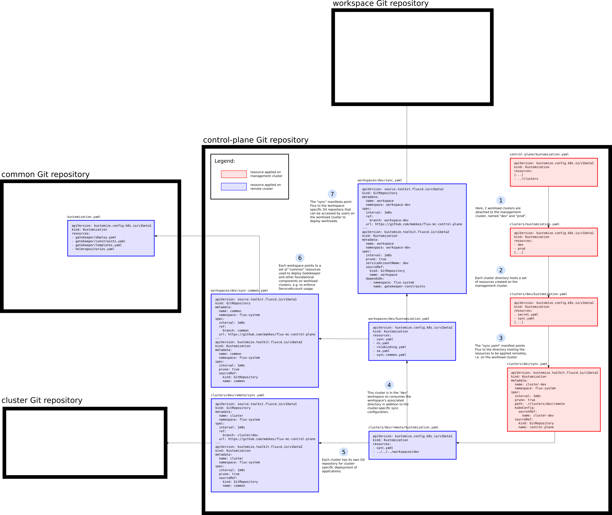

# Flux multi-cluster example repository

This repository demonstrates how Flux can be leveraged for centralized management of multiple clusters and multiple tenants per cluster. A management cluster is responsible for managing resource synchronization to workload clusters by means of applying Flux Kustomizations using each cluster's kubeconfig file.

## Terminology

### Workspace

A workspace is considered as the primary grouping of multiple clusters. One cluster can only be part of one workspace. All resources managed as part of a workspace (e.g. applications to be deployed) are synchronized across all clusters in that workspace, i.e. all clusters in a workspace will receive the same set of resources specific to that workspace.

### Tenant

The second layer of grouping is by tenants. Each cluster may host multiple tenants. Each tenant can only be part of one workspace.

### Management Cluster

This is the central cluster managing all attached workload clusters.

### Workload Cluster

This is a cluster attached to and managed by the management cluster.

## Quick Start

All of the following commands spin up kind clusters. Make sure you have the following commands installed:

* [kind](https://kind.sigs.k8s.io/)
* [flux](https://fluxcd.io/docs/get-started/#install-the-flux-cli)

First spin up the control plane cluster:

```sh
./create-management-cluster.sh
```

Then, create a workload cluster:

```sh
./create-and-attach-kind-cluster.sh -n attached -w dev
```

Now you have two clusters running, a management cluster and a workload cluster. Both are synchronized using (several branches of) this Git repository.

## Architecture

This is a diagram showing the various Flux resources created on the management cluster and on workload clusters.



### 
